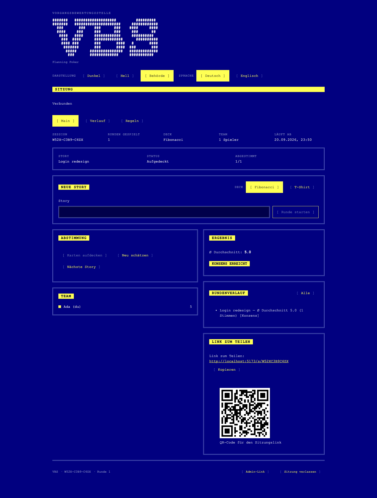
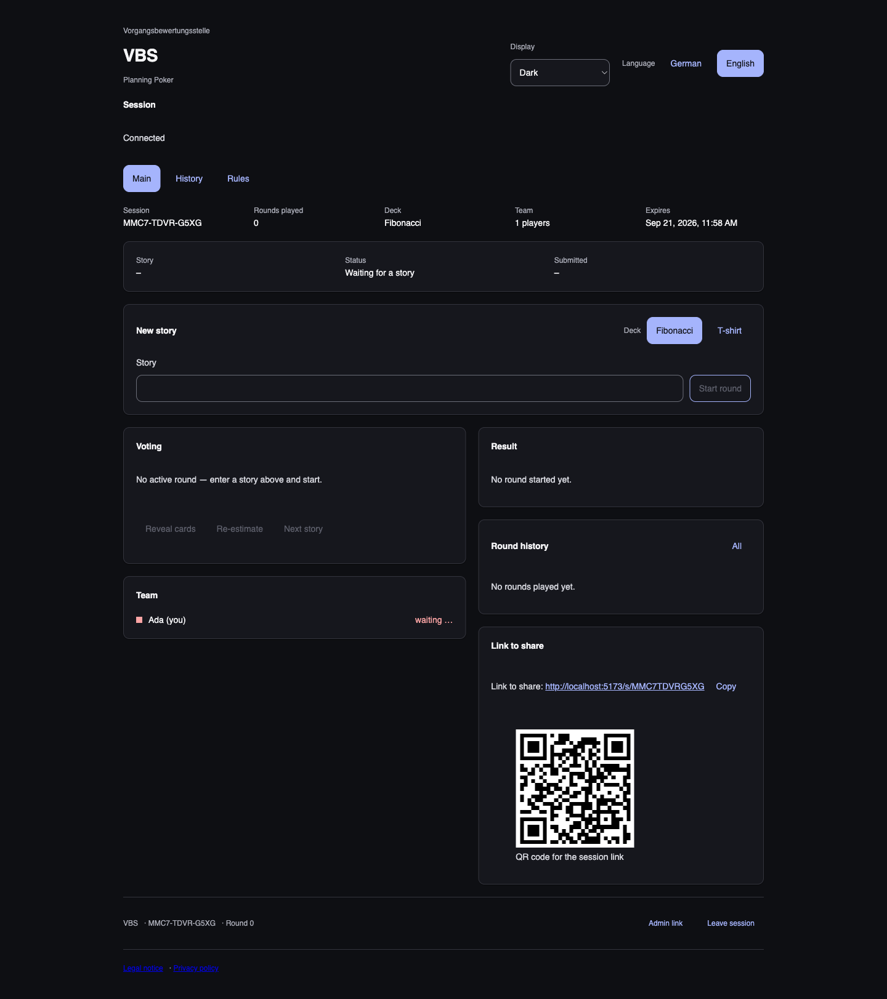

# Vorgangsbewertungsstelle (VBS)

[](https://github.com/phhbr/vbs/actions/workflows/ci.yml)
[](./LICENSE)

Planning poker for agile teams, styled like an early-2000s gaming portal.
Live at **[vbs.bruchner.dev](https://vbs.bruchner.dev)** — no sign-up, just
open a link and vote. Bilingual (German/English), free, no ads, no analytics
or tracking cookies (see the site's own [privacy notice](https://vbs.bruchner.dev/datenschutz)).

Architecture, roles, and the full request/response flow are documented in
[CLAUDE.md](./CLAUDE.md). Security posture and known trade-offs are in
[docs/security.md](./docs/security.md).

| Retro (`amt` theme)                                                         | Modern (dark)                                                                      |
| --------------------------------------------------------------------------- | ---------------------------------------------------------------------------------- |
|  |  |

Six themes ship in total (two modern, four retro), switchable per browser —
see [docs/prototype/STYLE.md](./docs/prototype/STYLE.md).

## Setup (macOS, Colima)

Prerequisites: [Homebrew](https://brew.sh), Node ≥ 22.12, pnpm, Colima.

```bash
brew install pnpm colima docker supabase/tap/supabase

# Start Colima once; it keeps running in the background afterwards
colima start

# Point the Docker CLI at Colima's socket (if not already set)
docker context use colima

# Install dependencies
pnpm install

# Frontend config: the local Supabase keys are the same fixed demo values
# on every machine, so the example file works as-is.
cp apps/web/.env.example apps/web/.env.local
```

### Frontend

```bash
pnpm dev                  # Vite dev server at http://localhost:5173
pnpm build                # production build of apps/web
pnpm lint && pnpm typecheck
pnpm test                 # Vitest across all packages
pnpm test:e2e             # Playwright — starts its own dev server, but needs
                           # local Supabase running first (see below)
```

### Backend (local Supabase)

Docker (via Colima) must be running.

```bash
supabase start             # starts Postgres, Auth, Realtime, Studio locally
supabase db reset          # replays migrations (+ seeds) from scratch
supabase test db --local   # pgTAP tests against the local database
pnpm gen:types              # regenerates packages/core/src/database.types.ts
supabase stop               # stops the local stack again
```

`supabase start` prints local URLs and keys (including the Studio URL and the
anon key for `apps/web`'s `.env.local` — see `.env.example`, already filled
in with those same fixed values).

**Colima gotcha:** with `mountType: sshfs` (Colima's default), the first
`supabase start` can fail with `chown ... permission denied` for
`supabase/snippets`, because Docker wants to create and chown that
bind-mounted directory itself, and sshfs won't allow it. The directory
already exists in the repo (`supabase/snippets/.gitkeep`), which is enough
to avoid the failure.

## Monorepo structure

- `apps/web` — React 19 + Vite + TypeScript, the application itself
- `packages/core` — generated DB types, deck definitions, pure display helpers
- `packages/ui` — components and design tokens (`tokens.css`)
- `supabase/` — schema migrations, RLS policies, pgTAP tests
- `docs/prototype/` — the binding visual prototype (see `STYLE.md`)
- `docs/security.md`, `docs/support-link.md` — design-decision write-ups
- `.github/workflows/` — CI (lint, typecheck, tests, secret scanning) and
  the production deploy workflow

## License

MIT — see [LICENSE](./LICENSE).
